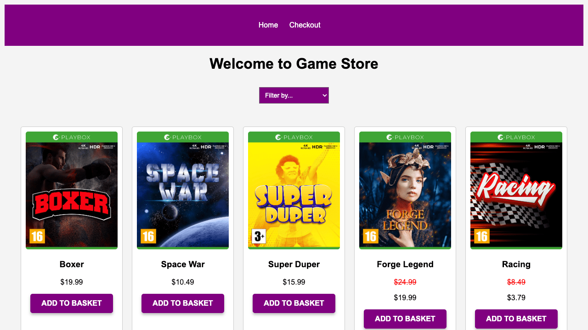

# Gamehub

A vanilla-JS storefront that lets gamers browse and filter game titles, view details, and manage a shopping basket.

## Live Demo

https://ebbestankiewicz.github.io/Gamehub-js-ca/

## Overview

Gamehub fetches a list of video games from the Noroff Gamehub API and displays them in a flexible grid. Users can:

- Filter games by price (low→high, high→low), age rating, release date, genre, or sale status.  
- Click on a product to see detailed information (cover image, description, price, age rating).  
- Add or remove items to/from a persistent shopping basket (stored in localStorage).  

This project was my Cross‐Course Assignment (CA) in the Noroff Frontend Programme.
